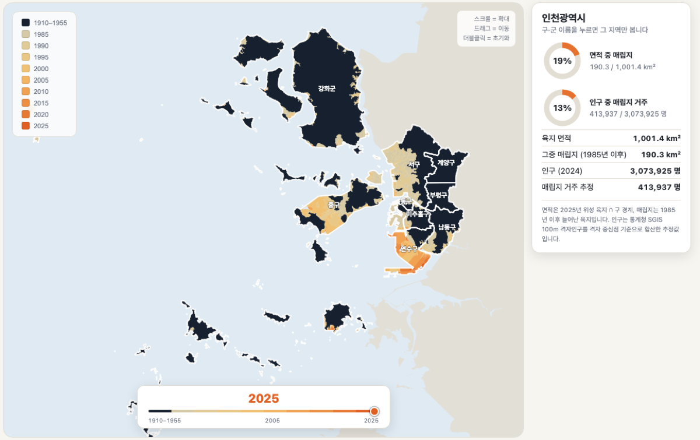

[English](README.md) | **한국어**

# 바다를 메워 만든 도시, 인천 (1910–2025)

> ### **[▶ 지도 열기 — wherewindstay.github.io/incheon-reclamation](https://wherewindstay.github.io/incheon-reclamation/)**
>
> *위 이미지는 정지 화면입니다. GitHub은 보안상 페이지 안에서 인터랙티브 지도를 실행하지 않으므로, 시점을 옮기거나 구·군을 눌러보려면 링크로 들어가세요.*

1910년부터 2025년까지 인천의 해안선을 등고선처럼 쌓아, 어느 시기에 어디를 메워 땅을 얻었는지 보여주는 인터랙티브 지도입니다.

이 범위 안에서 인천의 육지는 **766㎢에서 1,020㎢로** 늘었습니다. 지금 인천 육지의 **19.0%**(190.3㎢)가 1985년 이후에 생긴 땅이고, 인천 사람 **13.5%**(약 41만 4천 명)가 그 위에 살고 있습니다.

| 구·군 | 면적 중 매립지 | 인구 중 매립지 거주 |
|---|---:|---:|
| 연수구 | 73.2% | 53.9% |
| 중구 | 38.6% | 11.2% |
| 동구 | 24.5% | 1.5% |
| 서구 | 23.5% | 14.3% |
| 남동구 | 17.9% | 11.1% |
| 강화군 | 9.9% | 4.5% |
| 미추홀구 | 8.4% | 2.3% |
| 옹진군 | 7.5% | 3.4% |
| 부평구 | 1.3% | 1.7% |
| 계양구 | 0.9% | 0.6% |
| **인천 전체** | **19.0%** | **13.5%** |

## 데이터

| 시기 | 출처 | 방법 |
|---|---|---|
| 1910–1955 | 국사편찬위원회 [역사지리정보](https://hgis.history.go.kr/) | 시대별 행정구역 폴리곤을 육지 실루엣으로 병합 |
| 1985–2025 (5년 간격 9개 시점) | USGS Landsat 5/7/8/9 Collection 2 Level-2 (Google Earth Engine) | MNDWI 수체지수(green·SWIR)로 수역/육지를 가르고 30m 해상도로 벡터화 |
| 구·군 경계 | 통계청 SGIS 시군구(2025) | — |
| 인구 | 통계청 SGIS 100m 격자인구(2024) | 격자 중심점이 매립지 폴리곤 안에 드는지로 귀속 |

**매립지 정의**: 2025년 육지 − 1985년 육지.

## 읽을 때 주의할 점

- **MNDWI는 촬영 시점의 조위를 탑니다.** 갯벌이 넓은 구간(영종 서쪽·강화 남단)은 간조 영상이 섞이면 육지로 잡혀 경계가 다소 후하게 그려집니다. 1990→1995, 2020→2025처럼 면적이 소폭 뒷걸음치는 구간도 이 때문입니다.
- **1970~80년대 매립은 잡히지 않습니다.** 매립지를 "1985년 이후"로 정의했기 때문에, 남동공단처럼 그 이전에 메운 땅은 1985년 시점에 이미 육지입니다. 실제 누적 매립은 위 수치보다 큽니다.
- **백령·대청도는 빠져 있습니다.** 위성 분석 범위(ROI)의 서쪽 경계가 동경 125.65°입니다.
- **옹진군 인구는 과소추정일 수 있습니다.** SGIS 격자인구 5개 존 중 3개(가사·나사·다사)만 사용해, 나머지 존에 속한 일부 도서 인구가 빠졌습니다. 면적 계산에는 영향이 없습니다.
- **1910·1914·1955년은 한 겹으로 합쳤습니다.** 세 시점의 육지 윤곽 차이가 0.2㎢ 이하로 측정 한계 안에서 같습니다. 차이는 해안선이 아니라 내륙 행정경계 변경(부천군 편입, 인천부 부역확장)에서 옵니다.
- **역사지리 경계는 1985년 위성 육지 범위로 제한했습니다.** 행정구역 폴리곤은 갯벌·간석지를 포함해 실제 육지보다 넓게 잡히기 때문입니다.
- 인천 전체 육지면적이 1,001㎢로 공식 통계(약 1,065㎢)보다 6% 작습니다. Landsat 분류에서 갯벌 경계가 잘리는 정도의 차이입니다.

## 사용법

- 아래 슬라이더로 시점 이동 — 그 시점까지의 육지가 누적해서 쌓입니다
- 왼쪽 범례의 연도를 눌러 해당 층만 껐다 켜기
- 지도에서 구·군을 누르면 그 지역의 매립 비중, 빈 바다를 누르면 인천 전체
- 휠로 확대, 끌어서 이동, 더블클릭으로 초기화

## 기술

외부 의존이 없는 단일 HTML 파일입니다. 지도 라이브러리 없이 SVG로 직접 그렸고, 좌표는 전부 파일 안에 인라인되어 있어 오프라인에서도 열립니다.

## 라이선스

코드 MIT · 원본 데이터는 각 제공기관의 이용약관을 따릅니다.

## 만든 방법

데이터 수집과 GEE 노트북 작성은 박소현, 데이터 파이프라인과 시각화 구현은 Anthropic Claude의 도움을 받아 진행했습니다. 모든 수치는 원자료에서 직접 계산했고, 검증 지점(송도·영종공항·남동공단·구도심)을 실제 매립 연혁과 대조해 확인했습니다.
